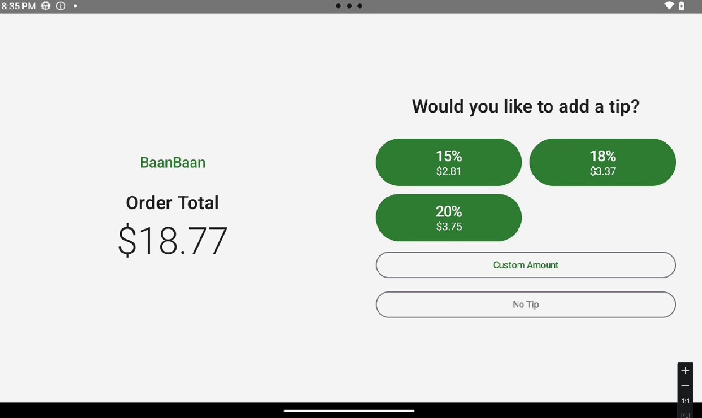
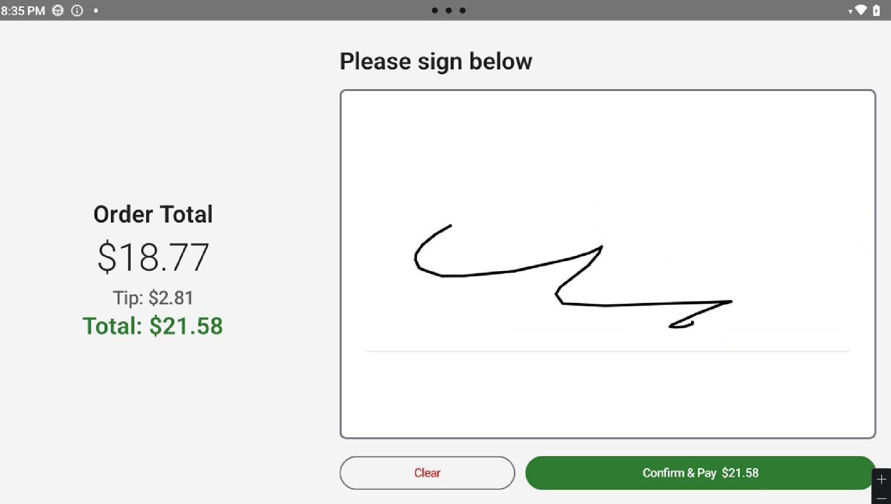
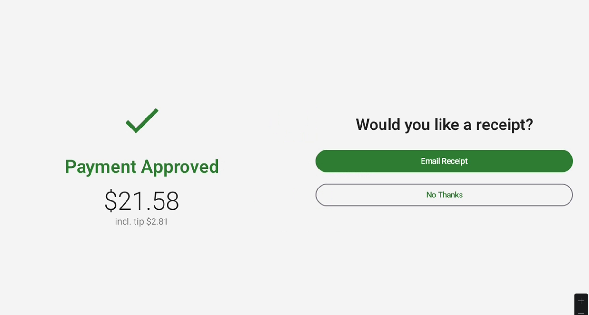

# BaanBaan Counter

Android tablet app for counter-facing payment terminals in restaurants. Handles tip selection, signature capture, and card payment via a Finix D135 Bluetooth card reader — driven entirely by a WebSocket server you control.

## Screenshots

| Tip selection | Signature | Payment complete |
|:---:|:---:|:---:|
|  |  |  |

## Architecture

```
┌─────────────────────────┐        WebSocket (LAN)         ┌──────────────────────────┐
│   Your POS / Backend    │ ◀───────────────────────────▶ │  BaanBaan Counter (this) │
│   (any language)        │                                │  Android tablet          │
└─────────────────────────┘                                └──────────┬───────────────┘
                                                                      │ Bluetooth
                                                           ┌──────────▼───────────────┐
                                                           │   Finix D135             │
                                                           │   Card reader            │
                                                           └──────────────────────────┘
```

The app is a **WebSocket client**. It connects to whatever server you point it at — there is no dependency on BaanBaan's backend. As long as your server speaks the protocol defined in [`COUNTER_WS_SPEC.md`](COUNTER_WS_SPEC.md), the app works with any POS or backend system.

### How it works

1. You run a WebSocket server that implements the [counter protocol](COUNTER_WS_SPEC.md).
2. The tablet connects to `ws://<your-host>:<port>/counter?token=<token>`.
3. Your server sends a `config` message with the Finix credentials and a display name — the app stores them and initializes the card reader.
4. When a customer is ready to pay, your server sends a `payment_request`. The app guides the customer through tip selection, signature, and card present payment.
5. The app sends back a `payment_result` the moment the transaction resolves. Your server marks the order paid (or retries on decline).

**Credentials are never embedded in the app.** They are provisioned at runtime by your server via the `config` message, so you can rotate them without a new build.

### Replacing the server

The original BaanBaan backend is a Bun (Node-compatible) server, but you can implement the same 3-message protocol in any language or framework. The spec includes a minimal Bun/TypeScript example to get you started. A mock server is also straightforward to write for local development and testing.

---

## What it does

- Connects to your WebSocket server and auto-reconnects on any disconnect (exponential backoff, max 30 s)
- Receives payment requests from your POS
- Guides the customer through: tip selection → signature → card tap/insert/swipe
- Reports the result (approved / declined / error / cancelled) back to your server
- Optionally captures a receipt email and forwards it to your server

## Hardware

| Device | Role |
|---|---|
| Lenovo Tab One ZAF00008US (8", Android 13) | Counter tablet running this app |
| Finix D135 | Card reader, connects via Bluetooth |

The app is locked to landscape orientation and keeps the screen on, as expected for a counter terminal.

## Tech stack

- Kotlin + Jetpack Compose (Material 3)
- Hilt dependency injection
- OkHttp WebSocket with auto-reconnect
- Finix PAX MPOS Android SDK 3.5.0
- Kotlinx Serialization

## Getting started

### Prerequisites

- Android Studio Hedgehog or later
- Android SDK 26+ (minSdk 26, targetSdk 34)
- A WebSocket server implementing [`COUNTER_WS_SPEC.md`](COUNTER_WS_SPEC.md)
- A Finix merchant account and D135 terminal
- The D135 paired via Bluetooth to the tablet before first run

### Build

```bash
cp local.properties.example local.properties
# Edit local.properties — set sdk.dir to your Android SDK path

./gradlew assembleDebug
```

### First-run setup

1. Install the APK on the tablet.
2. Open the app — it lands on the **Setup** screen.
3. Enter your WebSocket server URL (e.g. `ws://192.168.1.10:3000`) and API token.
4. Tap **Scan** to find the D135 and select it.
5. Tap **Connect** — the app connects and waits for the `config` message from your server.
6. Once your server sends `config`, the app shows the **Idle** screen and is ready to accept payments.

## Payment flow

```
SETUP → IDLE → PAYMENT_TIP → PAYMENT_SIGNATURE → PAYMENT_PROCESSING → PAYMENT_RESULT → IDLE
```

## WebSocket protocol

Full spec in [`COUNTER_WS_SPEC.md`](COUNTER_WS_SPEC.md).

**Your server → Counter:** `config`, `payment_request`, `cancel_payment`

**Counter → Your server:** `counter_status`, `payment_result`, `receipt_request`

## Project structure

```
app/src/main/java/org/baanbaan/counter/
├── data/
│   ├── model/          # WsMessage.kt, PaymentSession.kt
│   ├── prefs/          # CounterPrefs.kt (SharedPreferences wrapper)
│   └── ws/             # WsClient.kt (OkHttp WebSocket + reconnect)
├── di/                 # AppModule.kt (Hilt bindings)
├── mpos/               # MposManager.kt (Finix SDK wrapper)
└── ui/
    ├── screen/         # Compose screens (Idle, Payment, Signature, Processing, Result, Setup)
    ├── theme/          # Material 3 theme
    └── viewmodel/      # MainViewModel.kt (single VM, payment state machine)
```

## License

MIT — see [LICENSE](LICENSE).
